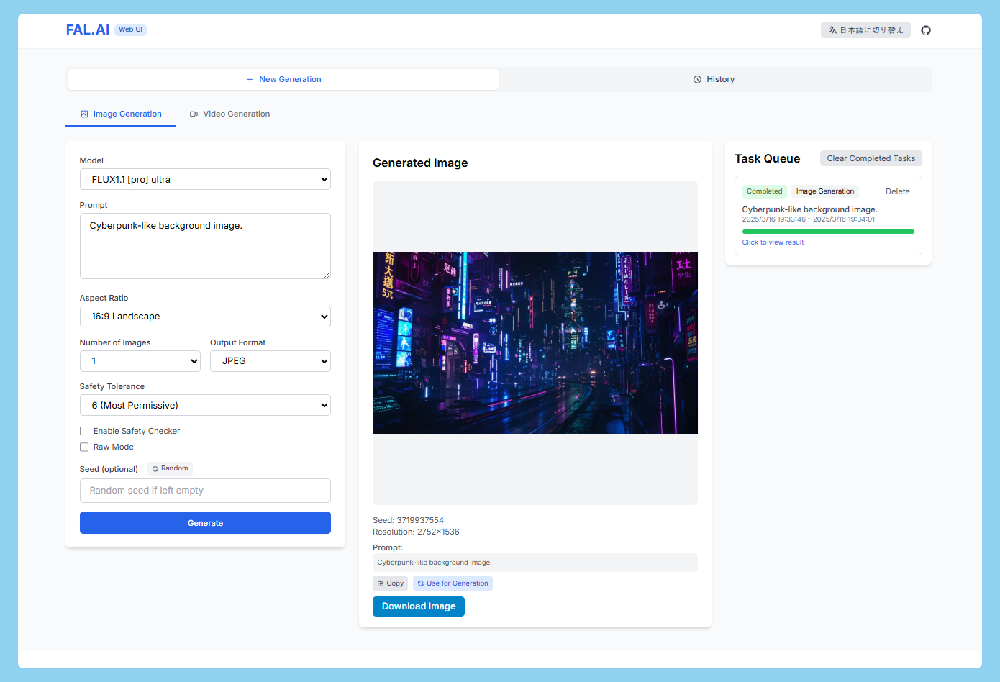

# Fal.ai WebUI


A modern web application built with Next.js that provides a user-friendly interface for interacting with fal.ai's text-to-image and text-to-video generation models.



## Features

- 🖼️ **Text-to-Image Generation**: Create images from text prompts using Flux models
- 🎬 **Text-to-Video Generation**: Generate videos from text prompts
- 🔄 **Task Queue**: Monitor ongoing generation tasks
- 📜 **History Panel**: Access previously generated content
- ⚙️ **Customizable Settings**: Configure model parameters including:
  - Image format and aspect ratio
  - Video resolution and aspect ratio
  - Safety filters
  - Seed values for reproducibility

## Supported Models

### Text-to-Image
- fal-ai/flux-pro/v1.1-ultra
- fal-ai/flux-pro/v1.1

### Text-to-Video
- fal-ai/wan-t2v
- fal-ai/wan/v2.1/1.3b/text-to-video

While the application currently supports a limited set of models, you can easily extend it to work with additional fal.ai models by referring to the [fal.ai API documentation](https://fal.ai/docs) and modifying the `fal-client.ts` file.

## Getting Started

### Prerequisites

- Node.js (version 18 or later)
- npm or yarn
- A fal.ai API key

### Installation

1. Clone the repository:
   ```
   git clone https://github.com/yourusername/fal-ai-webui.git
   cd fal-ai-webui
   ```

2. Install dependencies:
   ```
   npm install
   # or
   yarn install
   ```

3. Create a `.env.local` file in the root directory and add your fal.ai API key:
   ```
   FAL_KEY=your_api_key_here
   ```

4. Start the development server:
   ```
   npm run dev
   # or
   yarn dev
   ```

5. Open [http://localhost:3000](http://localhost:3000) in your browser to access the application.

## Architecture

The application uses:
- **Next.js**: For the frontend framework with server-side rendering
- **React**: For the UI components
- **TypeScript**: For type safety
- **Tailwind CSS**: For styling
- **fal.ai client**: For API integration

The application architecture follows a component-based approach with:
- Separate form components for text-to-image and text-to-video generation
- Shared components for history and task queue management
- A proxy API route for secure communication with fal.ai

## License

[MIT](LICENSE) 